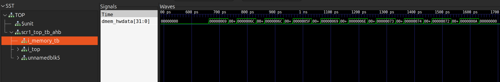

# Лабораторная работа №2

## Задание
Ознакомиться с возможностями настройки архитектуры системы команд, обработкой исключений/прерываний и принципами работы сборщика программ.

Настроить ядро следующим образом:
- адрес Reset Vector -- 0x1100
- адрес Trap Vector -- 0xbc00

Разработать обработчик для исключения Illegal instruction, обработка должна заключаться в выводе строки "ill_instr".

## Выполнение
### Конфигурация тестов
Необходимо оставить только тест `isa/rv32mi/illegal.S` из набора тестов `rv32_tests.inc`.

Для этого добавляем в список `rv32_isa_tests` только `isa/rv32mi/illegal.S`.

Теперь запустить этот тест в режиме генерации waveform со сбором трейсов можно с помощью команды:

```make run_verilator_wf TARGETS="riscv_isa" TRACE=1```.

После прохождения теста соответствующие артефакты будут находится в директории `./build/verilator_*/`.

### Обработчик исключения
Для реализации обработчика необходимо модифицировать код под меткой `trap_vector:` в `/sim/tests/common/riscv_macros.h`.

```
#define RVTEST_CODE_BEGIN                                               \
        .section .text.init;                                            \
        ILL_INSTR_MSG:                                                  \
        .string "ill_instr\n";                                          \
        .org 0x100, 0x0;                                                \
        .balign  64;                                                    \
        .weak stvec_handler;                                            \
        .weak mtvec_handler;                                            \
trap_vector:                                                            \
        /* test whether the test came from pass/fail */                 \
        csrr a4, mcause;                                                \
        li a5, CAUSE_USER_ECALL;                                        \
        beq a4, a5, _report;                                            \
        li a5, CAUSE_SUPERVISOR_ECALL;                                  \
        beq a4, a5, _report;                                            \
        li a5, CAUSE_MACHINE_ECALL;                                     \
        beq a4, a5, _report;                                            \
        li a5, CAUSE_ILLEGAL_INSTRUCTION;                               \
        bne a4, a5, skip_print;                                         \
        /* print our message */                                         \
        PRINT(0, ILL_INSTR_MSG, PRINT_ADDR_31_12)                       \
skip_print:                                                             \
        /* if an mtvec_handler is defined, jump to it */                \
        la a4, mtvec_handler;                                           \
        beqz a4, 1f;                                                    \
        jr a4;                                                          \
        /* was it an interrupt or an exception? */                      \
1:      csrr a4, mcause;                                                \
        bgez a4, handle_exception;                                      \
        INTERRUPT_HANDLER;                                              \
handle_exception:                                                       \
        /* we don't know how to handle whatever the exception was */    \
other_exception:                                                        \
        /* some unhandlable exception occurred */                       \
        li   a0, 0x1;                                                   \
_report:                                                                \
        j sc_exit;                                                      \
```

Резервируем 0x100 байт в начале секции `.text.init`, куда помещаем нашу строку.

Определяем макрос PRINT, осуществляющий вывод строки (последовательную запись символов по адресу 0xf0000000).

### Конфигурация ядра
Переопределяем следующие параметры:

```
parameter bit [`SCR1_XLEN-1:0]          SCR1_ARCH_RST_VECTOR        = 'h1100;            // Reset vector value (start address after reset)
parameter bit [`SCR1_XLEN-1:0]          SCR1_ARCH_MTVEC_BASE        = 'hBC00;            // MTVEC.base field reset value, or constant value for MTVEC.base bits that are hardwired

localparam [`SCR1_XLEN-1:0]      SCR1_SIM_EXIT_ADDR      = 32'h0000_BA00; // 0xbc00 - 0x200
```

- `SCR1_ARCH_RST_VECTOR` -- адрес Reset Vector (значение `pc` после reset'a)
- `SCR1_ARCH_MTVEC_BASE` -- адрес Trap Vector (значение `pc` после срабатывания trap)
- `SCR1_SIM_EXIT_ADDR` -- адрес выхода из симуляции (когда `pc == SCR1_SIM_EXIT_ADDR` симуляция завершается)

`SCR1_SIM_EXIT_ADDR` необходимо модифицировать, т.к. секцию `.text.init`, в которой он раcположена метка SIM_EXIT, пришлось сдвинуть, иначе секции `.text.init` и `.text.init` пересекались.

### Модификация linker-скрипта
```
  /* code segment */
  .text.init 0xbc00 - 0x200 : { 
    SIM_EXIT = .;
    LONG(0x13);
    SIM_STOP = .;
    LONG(0x6F);
    LONG(-1);
    . = 0x100;
    PROVIDE(__TEXT_START__ = .);
    *(.text.init) 
  } >RAM

  .text.start 0x1100: { 
    PROVIDE(__TEXT_END__ = .);
    PROVIDE(__TEXT_START__ = .);
    *(.text.start) 
  } >RAM
```

Размещаем `.text.start` (метку `_start:`) по адресу 0x1100.

Размещаем `.text.init` по адресу 0xba00, 0x100 выделено под метки `SIM_EXIT:` и `SIM_STOP:`, еще 0x100 под нашу строку, таким образом метка `trap_vector:` располагается по нужному адресу 0xbc00.

### Тестирование
Запускаем ```make run_verilator_wf TARGETS="riscv_isa" TRACE=1```.

```
---Test:                      illegal.hex
ill_instr
Test passed

#--------------------------------------
# Summary: 1/1 tests passed
#--------------------------------------

- /home/misuy/itmo/soc_design/scr1/src/tb/scr1_top_tb_runtests.sv:199: Verilog $finish
Simulation performed on Verilator 5.014 2023-08-06 rev v5.014
                          Test               | build | simulation
                     illegal.hex		OK	  PASS
```

Видно, что строка "ill_instr" вывелась и тест прошел.

В `illegal.dump` можно посмотреть разметку бинарника:

```
Disassembly of section .text.init:

0000ba00 <SIM_EXIT>:
...
0000bc00 <trap_vector>:

Disassembly of section .text.start:

00001100 <_start>:
```

Все метки расположены по нужным адресам.

В `tracelog_core_o.log` содержается трейсы:

```
37   E   00001204   00000000   0000bc00   mstatus    00001800
37   E   00001204   00000000   0000bc00   mepc       00001204
37   E   00001204   00000000   0000bc00   mcause     00000002
37   E   00001204   00000000   0000bc00   mtval      00000000
40   N   0000bc00   000047a1   0000bc04   x14_a4     00000002
41   N   0000bc04   04f70563   0000bc06   x15_a5     00000008
42   N   0000bc06   000047a5   0000bc0a   ---        --------
43   N   0000bc0a   04f70263   0000bc0c   x15_a5     00000009
44   N   0000bc0c   000047ad   0000bc10   ---        --------
45   N   0000bc10   02f70f63   0000bc12   x15_a5     0000000b
46   N   0000bc12   00004789   0000bc16   ---        --------
47   N   0000bc16   02f71063   0000bc18   x15_a5     00000002
48   N   0000bc18   f0000837   0000bc1c   ---        --------
49   N   0000bc1c   00000897   0000bc20   x16_a6     f0000000
50   N   0000bc20   ee088893   0000bc24   x17_a7     0000bc20
51   N   0000bc24   00088783   0000bc28   x17_a7     0000bb00
53   N   0000bc28   0000c791   0000bc2c   x15_a5     00000069
54   N   0000bc2c   00f82023   0000bc2e   ---        --------
56   N   0000bc2e   00000885   0000bc32   ---        --------
57   N   0000bc32   ff5ff06f   0000bc34   x17_a7     0000bb01
58   N   0000bc34   ffff5717   0000bc28   ---        --------
```

Видим срабатывание trap в строках с `Event == E`. Далее происходит переход по адресу `trap_vector:`, где можно увидеть вывод строки (инструкции 0000bc28 -- 0000bc34 выполняются для каждого символа).

`simx.vcd` -- waveform



Видим запись десяти сиволов (длина целевой строки).

## Вывод
Выполняя данную лабораторную работу, я изменил конфигурацию вычислительного ядра и linker-скрипта. Они взаимосвязаны и должны соответствовать друг-другу. Также реализовал кастомный обработчик исключения.